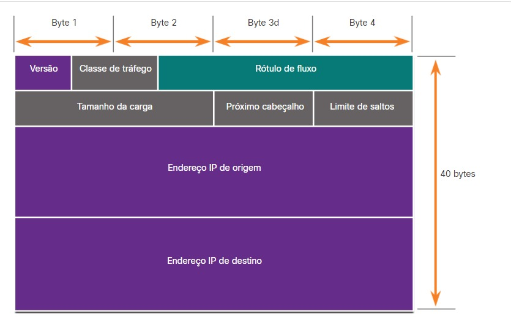
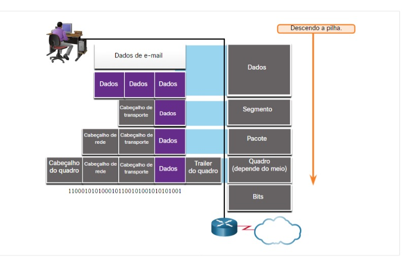

# CCNA 1

## Componentes de Rede
**Hosts**: Dispositivos conectados a uma rede que participam diretamente da comunicação da rede.

**IP (Internet Protocol)**: Identifica o host dentro de uma rede específica.

**Servidores**: São computadores com software que lhes permite fornecer informações, como email ou páginas web para outros dispositivos finais na rede.

Softwares comuns de servidores:
- Email
- Web
- Arquivos

Exemplo de software cliente: **navegador**.

**Rede ponto a ponto**: São redes em que temos computadores como servidor e clientes ao mesmo tempo.

Vantagens da **rede ponto a ponto**:
- Fácil de configurar
- Menos complexo
- Menor custo porque os dispositivos de rede e os servidores dedicados podem não ser necessários
- Pode ser usada para tarefas simples como transferir arquivos e compartilhar impressoras

Desvantagens da **rede ponto a ponto**:
- Nenhuma administração centralizada
- Não é tão segura
- Não é escalável
- Todos os dispositivos podem atuar como clientes e servidores, podendo deixar seu desempenho lento.

**Dispositivos Finais**: É a origem ou destino de uma mensagem transmitida na rede.

**Dispositivos Intermediários**: Conectam os dispositivos finais individuais à rede.

Exemplos de **dispositivos intermediários**:
- Roteador sem fio
- Roteador
- Switch LAN
- Switch Multicamada
- Dispositivo de firewall
  
Funções dos **dispositivos intermediários**:
- Regenerar e retransmitir sinais de comunicação
- Manter informação sobre quais caminhos existem pela rede e pela rede interconectada
- Notificar outros dispositivos sobre erros e falhas de comunicação
- Direcionar dados por caminhos alternartivos quando houver falha em um link
- Classificar e direcionar mensagens de acordo com as prioridades
- Permitir ou negar o fluxo de dados, com base em configurações de segurança

**Mídia ou meio de rede**: Fornece o canal pelo qual a mensagem viaja da origem ao destino.

Três tipos de mídia mais comuns:
- **Fios de metal dentro de cabos (cobre)**- Os dados são codificados em impulsos elétricos
- **Fibra de vidro ou plástico nos cabos (cabo de fibra óptica)** - Os dados são codificados em pulsos de luz
- **Transmissão sem fio** - Os dados são codificados através da modulação de frequências específicas de ondas eletromagnéticas

Critérios para a escolha da **mídia de rede**:
- Qual é a distância máxima pela qual o meio físico consegue carregar um sinal com êxito?
- Qual é o ambiente em que a mídia será instalada?
- Qual é a quantidade de dados e a que velocidade deve ser transmitida?
- Qual o custo do meio físico e da instalação

## Representações e topologias de rede
### Representação de Rede

Terminologia para descrever como cada um desses dispositivos e mídias se conectam:
- **Placa de interface de rede (NIC)**: Uma NIC conecta fisicamente o dispositivo final à rede
- **Porta física**: Um conector ou tomada em um dispositivo de rede onde a mídia se conecta a um dispositivo final ou outro dispositivo de rede
- **Interface**: Portas especializadas em um dispositivo de rede que se conectam a redes individuais. Como os roteadores conectam redes, as portas em um roteador são chamadas de interface de rede.
  
### Topologia Física
Os diagramas de topologia física ilustam a localização física dos dispositivos intermediários e a instalação dos cabos.

### Topologia Lógica
Diagramas de topologia lógica ilustram dispositivos, portas e o esquema de endereçamento da rede.

## Tipos comuns de redes

**Redes domésticas simples**: Conectam alguns computadores entre si e com a Internet. Permitem que se compartilhe recursos, como impressoras, documentos, imagens e música, entre alguns dispositivos finais locais.

**Redes para pequenos escritórios e escritórios domésticos (SOHO)**: Permite que computadores em um escritório em casa ou em um escritóirio remoto se conectem a uma rede corporativa, ou acessem recursos compartilhados centralizados.

**Redes médias e grandes**: Como as usadas por empresas ou escolas, podem ter muitos locais com centenas ou milhares de hosts interconectados. Fornecem consolidação, armazenamento e acesso a informações em servidores de rede.

**Rede Mundial**: A internet é uma rede de redes que conecta centenas de milhões de computadores em todo o mundo.

A **infra-estruturas** variam muito em termos de:
- Tamanho da área de cobertura
- Número de usuários conectados
- Número e tipos de serviços disponíveis
- Área de responsabilidade

**SPs**: provedores de serviços.

**ISPs**: provedores de serviços de Internet.

**LANs**: redes locais.

Características das **LANs**:
- Interconectam dispositivos finais em uma área limitada, como uma casa, uma escola, um edifício de escritórios ou um campus.
- Geralmente é administrada por uma única organização ou pessoa. O controle administrativo é imposto no nível da rede e governa as políticas de segurança e controle de acesso.
- Fornecem largura de banda de alta velocidade para dispositivos finais internos e dispositivos intermediários.

**WANs (Wide Area Network)**: redes de longa distância.

Características das **WANs**:
- Interconectam as LANs em grandes áreas geográficas, como entre cidades, estados, províncias, países ou continentes.
- Geralmente são administradas por vários prestadores de serviço.
- Geralmente fornecem links de velocidade mais lenta entre as LANs.

Organizações que ajudam a manter a estrutura e padronização dos protocolos e processos da Internet:
- Internet Engineering Task Force (IETF)
- Internet Corporation for Assigned Names and Numbers (ICANN)
- Internet Architeture Board (IAB)
- Etc...
  
**Intranet**: Uma conexão privada de LANs e WANs que pertencem a uma organização. É projetada para ser acessada apenas por membros da organização, funcionários ou outras pessoas autorizadas.

**Extranet**: Uma conexão para fornecer acesso segura e protegido a indivíduos que trabalham para uma organização diferente, mas exigem acesso aos dados da organização.

## Conexões com a Internet

Conexão comuns para usuários de pequenos escritórios e escritórios domésticos:
- **Cabo** - Normalmente oferecido por provedores de serviços de televisão a cabo, o sinal de dados da Internet transmite no mesmo cabo que fornece televisão a cabo. Ele fornece alta largura de banda, alta disponibilidade e uma conexão sempre ativa à internet.
- **DSL** - As linhas de assinante digital forncem alta largura de banda, alta disponibilidade e uma conexão sempre ativa à Internet. O DSL funciona utlizando a linha telefônica.
- **Celular** - O acesso celular à Internet usa uma rede de telefonia celular para se conectar. Onde quer que você possa obter um sinal de celular, você pode obter acesso à Internet por celular. O desempenho é limitado pelos recursos do telefone e da torre de celular à qual está conectado.
- **Satélite** - A disponibilidade do acesso à Internet via satélite é um benefício nas áreas em que, de outra forma, não teriam conectividade com a Internet. As antenas parabólicas exigem uma linha de visão clara para o satélite.
- **Conexão Discada (Dial - up)** - Uma opção de baixo custo que usa qualquer linha telefônica e um modem. Fornece baixa largura de banda, não recomendada caso seja necessário fazer grandes tranferências de dados, porém útil para acesso móvel durante a viagem.

Conexão comuns para empresas:
- **Linha Alugada Dedicada** - As linhas alugadas são circuitos reservados na rede do provedore de serviços que conectam escritórios geograficamente separados para redes privadas de vos e/ou dados. Os circuitos são alugados a uma taxa mensal ou anual.
- **Metro Ethernet ou Ethernet WAN** - As ethernet metropolitanas estendem a tecnlogia de acesso à LAN na WAN.
- **DSL de negócios** - O DSL comercial está disponível em vários formatos. Uma escolha popular é a linha de assinante digital simétrica (SDSL), que é semelhante a DSL do consumidor, mas fornece uploads e dowloads nas mesmas velocidades altas.
- **Satélite** - O serviço de satélite pode fornecer uma conexão quando uma solução com fio não está disponível.

**Redes Separadas Tradicionais**: São redes em que cada uma usa uma tecnologia diferente para transmitir o sinal de comunicação e não se comunicam entre si. Cada uma delas possuía seu próprio conjunto de regras e padrões para assegurar a comunicação bem-sucedida.

**Redes Convergentes**: Possuem a capacidade de fornecer dados, voz e vídeo entre muitos tipos diferentes de dispositivos na mesma infraestrutura de rede. Essa infraestrutura possui o mesmo conjunto de regras, contratos e normas de implementação.

## Redes Confiáveis
As quatro características básicas que uma arquitetura de rede deve atender:
- Tolerância a falhas
- Escalabilidade
- Qualidade do serviço (QoS)
- Segurança

Uma rede tolerante a falhas é aquela que limita o número de dispositivos afetados durante uma falha.

**Redundância**: Ter vários caminhos para um destino.

Uma rede escalável se expande reapidamente para oferecer suporte a novos usuáros e aplicativos. É importante que ela faça isso sem prejudir a experiência dos usuários já existentes.

**Qualidade do serviço**: É um mecanismo essencial para gerenciar os congestionamentos e garantir a entrega confiável do conteúdo para todos os usuário. Por exemplo, se um usuário está solicitando uma página Web e outro está em ligaçao. Com uma QoS configurada, o roteador é capaz de gerenciar o fluxo de trafégo de voz e de dados, priorizando as comunicações por voz se a rede ficar congestionada.

**Congestionamento**: Quando a demanda por largura de banda excede a quantidade disponível.

Os administradores de redes precisam abordar dois tipos de preocupações de segurança de rede: **Segurança da infraestrutura da rede** e **segurança da informação**.

Proteger a infraestrutura da rede inclui proteger fisicamente os dispositivos que fornecem conectividade de rede e impedir o acesso não autorizado ao software de gerenciamento que reside neles.

Existem três requisitos principais para atingir a segurança da rede:
- **Confidencialidade**: Significa que apenas os destinatários pretendidos e autorizados podem acessar e ler dados.
- **Integridade**: Garante aos usuários que as informações não foram alterada nas transmissão, da origem ao destino.
- **Disponibilidade**: Garante aos usuários acesso oportuno e confiávrl aos serviços de dados para usuários autorizados.

## Tendências Recentes

**(BYOD) Traga seu próprio dispositivo**: permite aos usuários finais a liberdade de usar ferramentas pessoais para acessar informações e se comunicar atráves da rede comercial ou do campus. BYOD significa o uso de qualquer dispositivo, de qualquer propriedade e em qualquer lugar.

**Colaboração On-line**: "Ato de trabalho com outro ou outros em projeto em parceria". As ferramentas de colaboração oferecem aos usuários uma maneira de conectar, interagir e alcançar instantaneamente seus objetivos.

**Comunicações em vídeo**.

**Computação em Nuvem**: é uma maneira para acessar e armazenar dados. Para empresas, ela amplia os recursos de TI sem exigir investimento em nova infraestrutura, treinamento de novas equipes ou licenciamento de novo software. Esses serviços estão disponíveis sob demanda e são entregues a qualquer dispositivo, sem comprometer segurança ou a sua função. São possíveis graças aos Data Centers.

**Data Centers**: São instalaçÕes usadas para hospedar sistemas de computador e componentes associados.

Existem quatro tipos principais de **nuvens**:
- **Nuvens públicas**: São fonecidos para o público geral, podem ser gratuitos ou em um modelo de pagamento por uso. Usa a internet para fornecer serviços.
- **Nuvens privadas**: Destinados a uma organizacão ou entidade específica, como um governo. Pode ser configurada usando a rede, mas é caro para contruir e manter. Pode ser gerenciada por uma organização externa com acesso estrito de segurança.
- **Nuvens híbridas**: Composta de duas ou mais nuvens (parte privada e parte pública), onde cada parte permanece um objeto distinto, mas ambas estão conectadas usando uma única arquitetura. Indivíduos em uma nuvem híbrida seriam capazes de ter graus de acesso a vários serviços com base em direitos de acesso do usuário.
- **Nuvens comunitárias**: Criada para uso exclusivo por entidades ou organizações específicas. A diferença entre a pública e comunitária são as necessidades funcionais que foram personalizadas para a comunidade. São semelhantes a um ambiente de nuvem pública, mas com níveis definidos de segurança, privacidade e até mesmo conformidade normatica de uma nuvem privada.

**Rede Porwerline**: Para redes domésticas usa a fiação elética existente para conectar dispositivos. É uma alternativa quando os cabos da rede de dads ou as comunicações sem fio não são possíveis ou eficazes.

**Banda Larga Sem Fio**: Pode ser usada em áreas em que cabo e DSL não estão disponíveis.

**Provedor de serviços de Internet sem fio (WISP)**: é um provedor que conecta assinantes a um ponto de acesso ou hot spot designado usando tecnologias sem fio semelhantes encontradas em redes locais sem fio domésticas (WLABs). São mais comuns em ambientes rurais.

**Serviço de banda larga sem fio**: Usa a mesma tecnologia celular que um telefone inteligente. Uma antena é instalada fora da residência, fornecendo conectividade com ou sem fio para os dispositivos na casa.

## Segurança de Redes

Ameaças esxternas comuns às redes:
- **Vírus, worms e cavalos de Tróia** - Eles contêm software ou código malicioso em execução no dispositivo do usuário.
- **Spyware e adware** - Estes são tipos de software que são instalados no dispositivo de um usuário. O softwre, em seguida, coleta secretamente informações sobre o usuário.
- **Ataques de dia zero**: Ocorrem no primeiro dia em que uma vulnerabilidade se torna conhecida.
- **Ataques de ator de ameaça**: Uma pessoa mal-intencionada ataca dispositivos de usuários ou recursos de rede.
- **Ataques de negação de serviço**: Esses ataques atrasam ou travam aplicativos e processos em uma dispositivo de rede.
- **Interceptação de dados e roubo**: Esse ataque captura informações privadas da rede de uma organização.
- **Roubo de identidade** - Esse ataque rouba as credenciais de login de um usuário para acessar informações privadas.

Componentes básicos de segurança para uma rede doméstica ou de pequeno escritório:
- **Antivirus e antispyware** - Esses aplicativos ajudam a proteger os dispositivos finais contra a infecção por software malicioso.
- **Filtragem por firewall** - A filtragem por firewall bloqueia o acesso não autorizado dentro e fora da rede. Isso pode incluir um sistema de firewall baseado em host que impede o acesso não autorizado ao dispositivo final ou um serviço básico de filtragem no roteador doméstico para impedir o acesso não autorizado do mundo externo à rede.
  
Componentes para segurança de uma rede comercial (Além dos componentes que são usados numa rede doméstica):
- **Sistemas de firewall dedicados**: Eles fornecem recursos de firewall mais avançados que podem filtrar grandes quantidades de tráfego com mais granularidade.
- **Listas de controle de acesso (ACL)** - Eles filtram ainda mais o acesso e o encaminhamento de tráfego com base em endereços e aplicativos IP.
- **Sitemas de prevenção de intrusões (IPS)** - Identificam ameaças de rápida disseminação, como ataques de dia zero ou hora zero.
-  **Redes privadas virtuais (VPN)** - Fornecem acesso seguro a uma organização para trabalhadores remotos.

## Sistemas Operacionais

Todo disposito final e de rede exige um SO.

**Hardware**: Parte fisíca de um computador, incluindo os componentes eletrônicos subjacentes.

**Kernel**: Comunica-se entre o hardware e o software de um computador e gerencia como os recursos de hardware são usados para atender aos requisitos de software.

**Shell**: Interface do usuário que permite que os usuários solicitem tarefas específicas do computador. Essas solicitações podem ser feitas por meio das interface CLI ou GUI

**CLI**: Interface de linha de comando, serve para que o usuário interaja com a shell.

**GUI**: Interface Gráfica do Usuário.

## Métodos de Acesso

**Console**: Esta é uma porta de gerenciamento físico que forece acesso fora de banda a um dispositivo Cisco. O acesso out-of-band refere-se ao acesso por meio de um canal dedicado de gerenciamento que é utilizado somente para fins de manutenção do dispositivo. A vantagem de usar uma porta do console é que o dispositivo está acessível mesmo que nenhum serviço de rede esteja configurado, como a configuração inicial. Um computador executando um software de emulação de terminal e um cabo de console especial para se conectar ao disposito são necessários para uma conexão de console.

**Secure Shell (SSH)**: É um método dentro da banda e recomendado para estabelecer remotamente uma conexão CLI segura, através de uma interface virtual, através de uma rede. Requerem serviços de rede ativos no dispositivo, incluindo uma interface ativa configurada com um endereço. A maioria das versões do Cisco IOS inclui um servidor SSH e um cliente SSH que podem ser usados para estabelecer sessões de SSH com outros dispositivos.

**Telnet**: É um método inseguro em banda para estabelecer remotamente uma sessão CLI, por meio de uma interface virtual, por uma rede. O Telnet não fornece uma conexão segura e criptografada e só deve ser usado em um ambiente de laboratório. A autenticação de usuário, as senhas e os comandos são enviados pela rede como texto simples. A melhor prática é usar SSH em vez de Telnet.

**Aux**: A porta AUX em um disposito Cisco fornece conexões fora de banda por uma linha telefônica.

## Programas de Emulação de Terminal

São usados para se conectar a um disposito de rede por uma conexão serial por uma porta do console ou por uma conexão SSH/Telnet.

Exemplos:
- PuTTY
- Tera Term
- SecureCRT

## Modos de Comando Primários

Como recurso de segurança, o software Cisco IOS separa o acesso de gerenciamento em dois modos de comando.

**Modo EXEC de usuário**: Possui recursos limitidados, mas é útil para operações básicas. Permite apenas um número limitado de comandos de monitoramento básicos, mas não permite a execução de nenhum comando que possa alterar a configuração do dispositivo. O modo EXEC usuário é identificado pelo prompt da CLI que termina com o símbolo `>`.

**Modo Exec privilegiado**: Para executar comandos de configuração, um administrador de rede deve acessar esse modo. Modos de configurações mais altos, como o modo fe configuração global, só podem ser acessados do modo Exec privilegiado. Esse modo pode ser identificado pelo prompt que termica com o símbolo `#`.

## Modo de configuração e modos de subconfiguração

Para configurar o dispositivo, o usuário deve entrar no modo de configuração global.

Nesse modo são feitas alterações na configuração via CLI que a afetam o funcionamento do dispositivo como um todo. O modo de configuração global é identificado por um prompt que termina com `(config)#` após o nome do dispositivo, como `Switch(config)#`.

No modo de configuração global, o usuário pode inserir diferentes modos de subconfiguração. Cada um desses modos permite a configuração de uma parte particular ou função do dispositivo IOS.

Exemplos:
- **Modo de configuração de linha**: Usado para configurar o acesso ao console, SSH, Telnet ou AUX.
- **Modo de configuração da interface**: Usado para configurar uma porta de switch ou interface de rede do roteador.

## Navegar entre os Modos do IOS

Para passar do modo **EXEC usuário** para **Exec privilegiado** o comando é `enable`, e para retornar para **Exec usuário** é `disable`.

Para entrar e sair do **modo de configuração global**: `configure terminal` no modo **Exec privilegiado** e para sair basta digitar `exit`.

Para entrar no **modo subconfiguração de linha**: `line tipo de acesso numero da linha de gerenciamento que deseja acessar`, `line console 0`. Use o comando `exit` para sair.

Para passar de qualquer **modo de subconfiguração** para o **modo de configuração global** o comando é `exit`.

Para passar de qualquer **modo de subconfiguração** para o **Exec privilegiado** o comando é `end` ou `Ctrl + Z`.

Também é possível passar de um **modo de subconfiguração** para outro.

## Estrutura Básica de Comandos do IOS

Cada comando do IOS possui um formato ou sintaxe específica e pode ser executado apenas no modo apropriado.

### Sintaxe geral de um comando:

- **Palavra-chave**: Este é um parâmetro específico definido no sistema operacional (na figura, protocolos ip)
- **Argumento**: Isso não é predefinido; é um valor ou variável definido pelo usuário (na figura, 192.168.10.5)

## Verificando a sintaxe dos comandos do IOS
- **Negrito**: o texo em negrito indica comandos e palavras-chave que você digita literalmente como mostrado.
- *itálico*: o texo em itálico indica argumentos para os quais você fornece valores.
- **[x]**: colchetes indicam um elemento opcional (palavra-chave ou argumento).
- **{x}**: chaves indicam um elemento necessário (palavra-chave ou argumento).
- **[x {y | z }]**: chaves e linhas verticais entre colchetes indicam uma necessidade dentro de um elemento opcional. Espaços são usados para delinear claramente partes do comando.

Exemplos que demonstram as convenções usadas para documentar e utilizar comandos do IOS:
- **ping** *ip-address* - O comando é **ping** e o argumento definido pelo usuário é o *endereço-IP* do dispositivo de destino. Por exemplo: `ping 10.10.10.5`.
- **traceroute** *ip-address* - O comando é **tracerout** e o argumento definido pelo usuário é o *endereço-IP* do dispositivo de destino. Por exemplo: `traceroute 192.168.254.254`.
  
## Recursos da Ajuda do IOS

O IOS tem duas formas de ajuda disponíveis: **ajuda sensível ao contexto** e **verificação da sintaxe do comando**.

A ajuda sensível ao contexto permite que você encontre resposta para as seguintes perguntas:
- Quai comandos estão disponíveis em cada modo de comando?
- Quais comandos começam com caracteres específicos ou grupo de caracteres?
- Quais argumentos e palavra-chave estão disponíveis para comandos específicos?

Para acessar a **ajuda sensível ao contexto**, basta inserir um ponto de interrogação, **?**, na CLI.

A **verificação da sintaxe de comando** verifica se um comandos válido foi inserido pelo usuário. O interpretador faz a verificação do comando da esquerda para a direita, se ele entende o comando, ele é executado e a CLI volta para o prompt apropriado. No entanto, se o interpretador não entender o comando, ele forncerá feedback descrevendo o que está errado com o comando.

## Teclas de Atalho e Atalhos
- **Tab**: Completa um nome de comando parcialmente digitdado.
- **Backspace**: Apaga o caractere à esquerda do cursor.
- **Ctrl + D**: Apaga o caractere no cursor.
- **Ctrl + K**: Apaga todos os caracteres do cursor até o final da linha de comando.
- **Esc D**: Apaga todos os caracteres do cursor até o final da palavra.
- **Ctrl + U ou Ctrl + X**: Apaga todos os caracteres do cursor de volta ao início do linha de comando.
- **Ctrl + W**: Apaga a palavra à esquerda do cursor.
- **Ctrl + A**: Move o cursor para o início da linha.
- **Seta esquerda ou Ctrl + B**: Movem o cursor um caractere para a esquerda.
- **Esc B**: Move o cursor uma palavra para a esquerda.
- **Esc F**: Mode o cursor uma palavra para a direita.
- **Seta direita ou Ctrl + F**: Movem o cursor um caractere para a direita.
- **Ctrl + E**: Move o cursor para o final da linha de comando.
- **Seta cima ou Ctrl + P**: Recupera os comandos no buffer do histórico, começando com o mais recente.
- **Crtl + R ou I ou L**: Exibe novamente o prompt do sistema e a linha de comando depois que uma mensagem do console é exibida.
- **Tecla Enter**: Exibe a próxima linha
- **Barra de Espaço**: Exibe a próxima tela
- **Qualquer outra chave**: Encerra a sequência de exibição, retornando ao modo Exec privilegiado.
- **Ctrl + C**: Sai de uma operação, quando em qualquer modo de configuração, finaliza o modo de configuração e retorna para o modo Exec privilegiado. Quando no modo de instalção, aborta de volta ao comando pronto.
- **Ctrl + Z**: Sai de uma operação, quando em qualquer modo de configuração, finalização ou modo de configuração e retornos para o modo Exec privilegiado.
- **Ctrl + Shift + 6**: Sequência de quebra para todas as finalidades usada para abortar pesquisas de DNS, tracerouts, pings, etc.

## Configuração básica de dispositivos

### Nomes de Dispositivo

Algumas diretrizes para nomear os dispositivos:
- Começar com uma letra
- Não conter espaços
- Terminar com uma letra ou dígito
- Usar somente letras, números e traços
- Ter menos de 64 caracteres

Para nomear um dispositivo basta entrar no modo de configuração global e usar o comando `hostname nome do dispositivo`, para voltar para o prompt padrão `no hostname`.

### Diretrizes de senha

O Cisco IOS pode ser configurado para usar senhas do modo hierárquico para permitir privilégios de acesso diferentes a um dispositivo de rede.

Recomendações para escolha de senhas:
- Senhas com mais de 8 caracteres
- Combinação de maiúsculas e minúsculas, números, caracteres especiais e/ou sequências númericas
- Evitar usar a mesma senha para todos os dispositivos
- Não usar palavras comuns, pois são facilmente advinhadas

Para proteger o acesso ao modo EXEC do usuário:
- Entrar no modo de configuração global
- Entrar no modo de subconfiguração em linha, exemplo: `line console 0`
- Usar o comando `password` seguido da senha desejada
- Usar o comando `login`
- Sair usando o comando `end`
- E pronto, agora ao acessar o console vai ser exigido uma senha

Para proteger o acesso EXEC privilegiado:
- Entrar no modo de configuração global
- usar o comando `enable secret` seguido da senha desejada
- Sair do modo usando `exit`
- Pronto
  
As linhas de terminal virtual (VTY) permitem acesso remoto usando Telnet ou SSH ao dispositivo. Muitos switches Cisco são compativeis com até 16 linhas VTY numeradas de 0 a 15.

Para proteger linhas VTY:
- Entrar no modo de configuração global
- entrar no VTY de linha usando o comando `line vty 0 15`
- Usar o comando `password` seguido da senha desejada
- Ativar o acesso com o comando `login`
- Sair com o comando `end`

### Criptografar as Senhas

Os arquivos **startup-config** e **running-config** exibem a maioria das senhas em texto simples. Esta é uma ameaça a segurança.

Para criptografar todas as senhas de texto simples:
- Entrar no modo de configuração global
- Usar o comando `service password-encryption`
- Para verificar se as senhas foram ciptografadas basta usar o comando `show running-config`

### Mensagens de Banner

É vital fornecer um método para declarar que apenas pessoal autorizado deve tentar acessar o dispositivo. Banners podem ser uma parte importante do processo legal caso alguém seja processado por invadir um dispositivo. Alguns sistemas legais não permitem processo, ou mesmo o monitoramento de usuários, a menos que haja uma notificação visível.

Para criar uma mensagem de banner em um dispositivo de rede:
- Acesse o modo de configuração global
- Use o comando `banner motd #mensagem que será mostrada#`
  
## Salvar configurações
### Arquivos de configuração

Existem dois arquivos que armazenam a configuração do dispositivo:
- **startup-config**: Este é o arquivo de configuração salvo armazenado na NVRAM. Ele contém todos os comandos que serão usados pelo dispositivo na inicialização ou reinicialização. O flash não perde seu conteúdo quando o dispositivo está desligado.
- **running-config**: Isto é armazenado na memória de acesso aleatório (RAM). Ele reflete a configuração atual. A modificação de uma configuração ativa afeta o funcnionamento de um dispositivo Cisco imediatamente. A RAM é uma memória volátil. Ela perde todo o seu conteúdo quando o dispositivo é desligado ou reiniciado.

No tópico anterior já tem como ver a configuração de execução.

Para visualizar o arquivo de configuração de inicialização: `show startup-config`.

Para salvar as alterações feitas na configuração:
- Dentro do modo EXEC privilegiado usar o comando `copy running-config startup-config`.

### Alterar a configuração ativa

Se as alterações ainda não tiverem sido salvas, podemos restaurar o dispositivo para a configuração anterior usando o comando `reload` dentro do modo EXEC privilegiado, isso restaura as configurações do startup-config.

Quando usamos o `reload` para remover uma configuração, o dispositivo fica offline por um breve período de tempo.

Caso as alterações tenha sido salvas, dentro do modo EXEC privilegiado vamos usar o comando `erase startup-config`. Após isso, devemos recarregar o dispositivo para remover o arquivo de configuração atual em execução na RAM. Ao reiniciar, um switch carragará a configuração de inicialização padrão que foi fornecida originalmente com o dispositivo.

## Portas e Endereços

### Endereços IP

Endereços IP permitem que os dispositivos possam se localizar e estabeler uma comunicação ponto a ponto na internet. Cada dispositivo final deve ser configurado com um endereço de IP.

Exemplos de dispositivos finais que precisam ter um IP:
- Computadores
- Impressoras de rede
- Telefones VoIP
- Câmeras de segurança
- Smartphones
- Dispositivos móveis portáteis

A estrutura de um endereço **IPv4** é chamada notação decimal com ponto e é representada por quatro números decimais entre 0 e 255. Os endereços **IPv4** são atribuidos individualmente a dispositivos conectados a uma rede.

Com o endereço **IPv4**, uma máscara de sub-rede também é necessária. Uma máscara de sub-rede **IPv4** é um valor de **32 bits** que diferencia a parte da rede do endereço da parte do host. Juntamente com o endereço **IPv4**, a máscara de sub-rede determina qual sub-rede p dispositivo é membro.

**Endereço de gateway**: é o endereço IP do roteador que o host usará para acessar redes remotas, incluindo a internet.

#### Exemplo IPv4

#### Exemplo IPv6
Os endereços **IPv6** têm **128 bits** e são escritos como uma sequência de valores hexadecimais. A cada quatro bits é representado por um único dígito hexadecimal; para um total de **32 valores hexadecimais**. Grupos de quatro dígitos hexadecimaissão separados por dois pontos (:). Os endereços **IPv6** não diferenciam maiúsculas e minúsculas e podem ser escritos tanto minúsculas como em maiúsculas.

### Interfaces e Portas

As comunicações em rede dependem de interfaces do dispositivo de usuário final, interfaces do dispositivo de rede e cabos que as conectam. Cada interface física tem especificações ou padrões que a definem. Um cabo conectado à interface deve ser projetado de acordo com os padrões físicos da interface. Os tipos de mídia de rede incluem cabos de cobre de par trançado, cabos de fibra óptica, cabos coaxiais ou sem fio.

Difierentes tipos de meio físico de rede oferecem características e benefícios diferentes. Nem todas as mídias de rede têm as mesmas características. Nem todas as mídias são apropriadas para o mesmo propósito.

Algumas diferenças entre os vários tipos de mídia:
- A distância pela qual o meio físico consegue carregar um sinal com êxito
- O ambiente no qual o meio físico deve ser instalado
- A quantidade e a velocidade de dados nas quais eles devem ser transmitidos
- O custo do meio físico e da instalação
  
## Configurar Endereços IP

### Configuração Manual de Endereço IP para dispositivos finais

As informações de endereço **IPv4** podem ser inseridas nos dispositivos finais manualmente ou automaticamente usando o **DHCP (Dynamic Host Configuration Protocol)** .

Para configurar manualmente um endereço **IPv4** em um host do Windows:
- Abrir o painel de controle
- Centro de compartilhamento de rede
- Mudar as configurações do adaptador e escolher o adaptador.
- Clicar com o botão direito do mouse e selecionar propriedades
- Destacar **Internet Protocol Version 4 (TCP/IPv4)** e clicar em propriedades
- Configurar as informações de endereço IPv4 e máscara dse sub-rede e o getway padrão.

Para configurar **IPv6** os passos são semelhantes.

### Configuração Automática de Endereço de IP para dispositivos finais

Os dispositivos finais geralmente usam o DHCP para configuração automática de endereço **IPv4**.

Em uma rede, o DHCP habilita a configuração automática de endereço IPv4 para todos os dispositivos finais habilitados para DHCP.

Para configurar DHCP em um PC Windows, basta selecionar **Obter um Endereço de IP automaticamente** e **Obter endereço do servidor DNS automaticamente**.

Para exibir as definições de configuração de IP em um PC com Windows, basta usar o comando **ipconfig** no prompt de comando.

### Configuração da Interface Virtual de Switch

Para configurar um SVI em um switch, use o comando `interface vlan 1` no modo de configuração global. Em seguida, atribua um endereço IPv4 usando o comando `ip address ip-address subnet-mask`. Por fim, ative a interface virtual usando o comando `no shutdown`.

Para configurar o default-gateway: `ip default-gateway ip-address`. 

## Protocolos e modelos

### Fundamentos das Comunicações

Todos os métodos de comunicação possuem os três elementos em comum:
- **Fonte da mensagem (remetente)**: As fontes da mensagem são pessoas ou dispositivos eletrônicos que precisam enviar uma mensagem para outras pessoas ou dispositivos.
- **Destino da mensagem (destinatário)**: O destino recebe a mensagem e a interpreta.
- **Canal**: consiste na mídia que fornece o caminho pelo qual a mensagem viaja da origem ao destino.

### Protocolos de Comunicação

O envio de uma mensagem, seja por comunicação presencial ou por rede, é regedio por regras chamadas protocolos. Esses protocolos são específicos ao tipo de método de comunicação que está sendo usado.

### Estabelecimento de Regras

Os protocolos devem ter em conta os seguintes requisitos para entregar com êxito uma mensagem compreendida pelo receptor:
- Um emissor e receptor identificados;
- Língua e gramática comum;
- Velocidade e ritmo de transmissão;
- Requisitos de confirmação ou recepção.

### Requisitos de protocolo de rede

Protocolos de computador comuns incluem os seguintes requisitos:
- Códificação de mensagens;
- Formatação e encapsulamentos de mensagens;
- Tamanho da mensagem;
- Tempo da mensagem;
- Opções de envio de mensagem.

### Codificação de Mensagens

Uma das primeiras etapas para enviar uma mensagem é codificá-la.

**Condificação**: É o processo de conversão de informações em outra forma aceitável para a transmissão.

**Decodificação**: Reverte o processo de codificação para interpretar as informações.

A codificação entre hosts deve estar em um formato adequado com o meio físico. As mensagens enviadas pela rede são convertidas primeiramente em bits pelo host emissor. Cada bit é codificado em um padrão de tensões em fios de cobre, luz infravermelha em fibra ópticas ou microondas para sistemas sem fio. O host de destino recebe e decodifica os sinais para interpretar a mensagem.

### Formatação e Encapsulamento de Mensagens

Quando uma mensagem é enviada da origem para o destino, deve usar um formato ou uma estrutura específica. Os formatos da mensagem dependem do tipo de mensagem e do canal usado para entragá-la.

Semelhante ao envio de uma carta, uma mensagem enviada por uma rede de computadores segue regras específicas de formato para que ela seja entregue e processada.

**Internet Protocol (IP)**: é um protocolo com uma função semelhante ao exemplo de envelope.

Na figura acima, os campos do pacote IPv6 (Internet Protocol version 6) identificam a origem do pacote e seu destino. IP é responsável por enviar uma mensagem da origem da mensagem para o destino através de uma ou mais redes.

### Tamanho da Mensagem

Quando uma mensagem longa é enviada de um host a outro em uma rede, é necessário dividir a mensagem em partes menores. As regras que regem o tamanho das partes, ou quadros, transmitidos pela rede são muito rígidas. Também podem diferir, dependendo do canal usado. Os quadros que são muito longos ou muitos curtos não são entregues.

As restrições de tamanho dos quadros exigem que o host origem divida uma mensagem longa em pedaços individuais que atendam aos requisitos de tamanho mínimo e máximo. A mensagem longa será enviada em quadros separados, e cada um contém uma parte da mensagem original. Cada quadro também terá suas próprias informações de endereço. No host destino, as partes individuais da mensagem são reconstruídas na mensagem original.

### Temporização de Mensagem

A temporização da mensagem inclui o seguinte:
- **Controle de Fluxo**: Este é o processo de gerenciamento da taxa de transmissão de dados. O controle de fluxo define quanta informação pode ser enviada e a velocidade com que pode ser entregue. Na comunicação de rede, existem protocolos de rede usados pelos dispositivos de origem e destino para negociar e gerenciar o fluxo de informações.
- **Tempo limite de resposta**: Os hosts da rede usam protocolos de rede que especificam quanto tempo esperar pelas resposta e que ação executar se ocorrer um tempo limite de resposta.
- **Método de acesso**: determinar quando alguém pode enviar uma mensagem. Quando um deseja transmitir em uma LAN sem fio, é necessário que a placa de interface de rede (NIC) da WLAN determine se a mídia sem fio está disponível.

### Opções de envio de mensagem

Existem três tipos de comunicações de dados:
- **Unicast**: informações são transmitidas apenas para um dispositivo.
- **Multicast**: informações estão sendo transmitidas para um ou mais dispositivos.
- **Broadcast**: Informação são transmitidas para todos os dispositivos da rede.

### Uma Nota sobre o Ícone de Nó

Documentos e topologias de rede geralmente representam dispositivos de rede e finais usando um ícone de nó. 

## Protocolos

### Visão geral do protocolo de rede

Tipos de protocolos necessários para habilitar as comunicações em uma ou mais redes:
- **Protocolos de comunicação em rede**: permitem que dois ou mais dispositivos se comuniquem através de um ou mais redes. A família de tecnologias Ethernet envolve uma variedade de protocolos como IP, Transmission Control Protocol (TCP), HyperText Protocolo de transferências (HTTP) e muito mais.
- **Protocolos de segurança de rede**: protegem os dados para fornecer autenticação, integridade dos dados e criptografia de dados. Exemplos de protocolos seguros incluem o Secure Shell (SSH), SSL (Secure Sockets Layer) e TLS (Transport Layer Security).
- **Protocolos de Roteamento**: permitem que os roteadores troquem informações de rota, compare caminho e, em seguida selecionar o melhor caminho para o destino remoto. Exemplos de protocolos de roteamento: Open Shortest Path First (OSPF) e Border Gateway Protocol (BGP).
- **Protocolos de descoberta de serviço**: são usados para detecção automática de dispositiovs ou serviços. Exemplos: Host dinâmico Protocolo de configuração (DHCP) que detecta serviços para endereço IP alocação e Sistema de Nomes de Domínio (DNS) que é usado para executar conversão de nome para endereço IP.

### Funções de protocolo de rede

**Endereçamento**: Identifica o remetente e o destinatário pretendido usando um esquema de endereçamento definido. Exemplos: Ethernet, IPv4 e IPv6.

**Confiabilidade**: Fornece mecanismos de entrega garantidos em caso de mensagens são perdidas ou corrompidas em trânsito. O TCP fornece essa garantia.

**Controle de Fluxo**: Garante que os fluxos de dados a uma taxa eficiente entre dois dispositivos de comunicação. O TCP fornece serviços de controle de fluxo.

**Sequenciamento**: Rotula exclusivamente cada segmento de dados transmitido. Usa as informações de sequenciamento para remontar as informações corretamente. Isso é útil se os segmentos de dados forem perdidos, atrasados ou recebidos fora de ordem. O TCP fornece serviços de sequenciamento.

**Detecção de erros**: é usada para determinar se os dados foram corrompidos durante a transmissão. Protocolos que possuem tal função: Ethernet, IPv4, IPv6 e TCP.

**Interface de aplicação**: contém informações usadas para processo a processo comunicações entre aplicações de rede. Por exemplo, ao acessar uma página Web, protocolos HTTP ou HTTPS são usados para se comunicar entre os processos da Web do cliente e do servidor.

### Interação de Protocolos

Alguns protocolos que são usados quando um dispositivo envia uma solicitação para um servidor Web para sua página de Web:
- **Protocolo de transferência de hipertexto (HTTP)**: controla a maneira como um servidor da web e um cliente da web interagem. O HTTP define o conteúdo e formatação das solicitações e respostas trocadas entre o cliente e o servidor. Tanto o software do cliente quanto o do servidor Web implementam HTTP como parte da aplicação. O HTTP conta com outros protocolos para reger o modo como as mensagens são transportadas entre cliente e servidor.
- **Tramission Control Protocol (TCP)**: Gerencia as conversas individuais. A TCP é responsável por garantir a entrega confiável das informações e gerenciar o controle de fluxo entre os dispositivos finais.
- **Protocolo Internet (IP)**: É responsável por entregar mensagens do remetente para o receptor. IP é usado por roteadores para encaminhar como mensagens em várias redes.
- **Ethernet**: É responsável pela entrega de mensagens de uma NIC para outra NIC na mesma rede local (LAN) Ethernet. 

## Conjuntos de Protocolos

### Conjuntos de protocolos de rede

Uma das melhores maneiras de visualizar como os protocolos dentro de uma suíte interafem é ver a interação como uma pilha. Uma pilha de protocolos mostra como os protocolos individuais dentro de uma suíte são implementados. Os protocolos são visualizados em termos de camadas, com cada serviço de nível superior, dependendo da funcionalidade definida pelos protocolos mostrados nos níveis inferiores. As camadas inferiores da pilha estão relacionada com a movimentação de dados pela rede e o fornecimento de serviços às camadas superiores, que se concentram no conteúdo da mensagem que está sendo enviada.

### Evolução dos conjuntos de protocolos

Uma suíte de protocolos é um grupo de protocolos que funcionam em conjunto para fornecer serviços abrangentes de comunicação em redes.

- **Internet Protocol Suite ou TCP/IP**: é o conjunto de protocolos mais comum e relevante usado hoje. O conjunto de protocolos TCP/IP é um conjunto de protocolos padrão aberto mantido pela Internet Engineering Task Force (IETF).
- **Protocolos de Interconexão de SIstemas Abertos (OSI)**: Está é uma família de protocolos desenvolvidos conjuntamente em 1977 pela Organização Internacional de Normalização (ISO) e pela União Internacional de Telecomunicações (UIT). O protocolo OSI também inclui um modelo de sete camadas chamdado de modelo de referência OSI. O modelo de referência OSI categoriza as funções de seus protocolos. Hoje OSI é conhecido principalmente por seu modelo em camadas. Os protocolos OSI foram amplamente substuídos por TCP/IP.
- **AppleTalk**: Um conjunto de protocolos proprietário de curta duração lançado pela Apple Inc. em 1985 para dispositivos Apple. Em 1995, a Apple adotou o TCP/IP para substituir o AppleTalk.
- **Novell NetWare**: Um conjunto de protocolos propriétario de curta duração e sistema operacional de rede desenvolvido pela Novell Inc. em 1983 usando o protocolo de rede IPX. Em 1995, a Novell adotou o TCP/IP para substituir o IPX.

### Exemplo de protocolo TCP/IP

Os protocolos TCP/IP estão disponíveis para as camadas de aplicativo, transporte e Internet. Não há protocolos TCP/IP na camada de acesso à rede. Os protocolos LAN da camada de acesso à rede mais comuns são os protocolos Ethernet e WLAN. Os protocolos da camada de acesso à rede são responsáveis por entregar o pacote IP pela mídia física.

### Suíte de Protocolos TCP/IP

TCP/IP é o conjunto de protocolos usado pela internet e as redes de hoje. O TCP/IP tem dois aspectos importantes para forncedores e fabricantes:
- **Conjunto de protocolos de padrão aberto**: Isso significa que está disponível gratuitamente ao público e pode ser usado por qualquer forncedor em seu hardware ou software.
- **Conjunto de protocolos com base em padrões**: Isso significa que foi endossado pela indústria de rede e aprovado por uma organização de padrões. Isso garante que produtos de diferentes fabricantes possam interoperar com êxito.

#### Camada de aplicação
- Sistema de nomes
  - **DNS**: Sistema de nomes de domínio. Converte nomes de domínio, como cisco.com, em endereços IP.
- Configuração de hosts
  - **DHCPv4**: Protocolo de configuração de host dinâmico para IPv4. Um servidor DHCPv4 atribui dinamicamente informações de endereçamento IPv4 aos clientes DHCPv4 na inicialização e permite que os endereços sejam reutilizados quando não forem mais necessários.
  - **DHCPv6**: Protocolo de configuração de host dinâmico para IPv6. Semelhante ao DHCPv4. Um servidor DHCPv6 atribui dinamicamente informaçÕes de endereçamentro IPV6 aos clientes DHCPv6 na inicialização.
  - **SLAAC**: Configuração automática de endereço sem estado. Um método que permite que um dispositivo obtenha suas informações de endereçamento IPv6 sem usar um servidor DHCPv6.
- Email
  - **SMTP**: Protocolo de tranferência de correio simples. Permite que os clientes enviem emails para um servidor de email e permite que os servidores enviem email para outros servidores.
  - **POP3**: Post Office Protocol versão 3. Permite que os clientes recuperem emails de um servidor de email e baixem o email para o aplicativo de email local do cliente.
  - **IMAP**: Protocolo de Acesso à Mensagem na Internet. Permite que os clientes acessem o email armazenado em um servidor de email e também mantenham o email no servidor.
- Tranferência de arquivos
  - **FTP**: Protocolo de tranferência de arquivos. Define regras que permitem que um usuário em um host acesse e transfira arquivos para e de outro host em uma rede. O FTP é um protocolo de entrega de arquivos confiável, orientado a conexão e reconhecido.
  - **SFTP**: Protcolo de tranferência de arquivos SSH. Como uma extensão do protocolo SSH, o SFTP pode ser usado para estabelecer uma sessão segura de tranferência de arquivos na qual a transferência é criptografada. SSH é um método para login remoto seguro que normalmente é usado para acessar a linha de comando de um dispositivo.
  - **TFTP**: Protocolo de tranferência de Arquivos trivial. Um protocolo de transferência de arquivos simples e sem conexão com entrega de arquivos não confirmada e de melhor esforço. Ele usa menos sobrecarga que o FTP.
- Web e serviço Web
  - **HTTP**: Protocolo de tranferência de hipertexto. Um conjunto de regras para a troca de texto, imagens gráficas, som, vídeo e outros arquivos de multimídia na World Wide Web.
  - **HTTPS**: HTTP seguro. Uma forma segura de HTTP que criptografa os dados que são trocados pela WWW.
  - **REST**: Representational State Transfer. Um serviço Web que utiliza interfaces de programação de aplicações (APIs) e pedidos HTTP para criar aplicações Web. 

#### Camada de Transporte
- Conexão orientada
  - **TCP**: Protocolo de controle de transmissão. Permite a comunicação confiável entre processos executados em hosts separados e fornece transmissões confiáveis e reconhecidas que confirmam a entrega bem-sucedida.
- Sem Conexão
  - **UDP**: Protocolo de datagrama do usuário. Permite que um processo em execução em host envie pacotes para um processo em execução em outro host. No entanto, o UDP não confirma a trasmissão bem-sucedida do datagrama.

#### Camada de Internet
- Protocolo IP
  - **IPv4**: Recebe segmentos de mensagem da camada de transporte, empacota mensagens em pacotes e endereça pacotes para entrega de ponta a ponta através de uma rede. O IPv4 usa um endereço de 32 bits.
  - **IPv6**: Semelhante ao IPv4, mas usa um endereço de 128 bits.
  - **NAT**: Tradução de endereços de rede. Converte endereócs IPv4 de uma rede privada em endereços IPv4 públicos globalmente exclusivos.
- Mensagens
  - **ICMPv4**: Protocolo de mensagens de controle da internet para IPv4. Fornece feedback de um host de destino para um host de origem sobre erros na entrega de pacotes.
  - **ICMPv6**: Semelhante ao ICMPv4.
  - **ICMPv6 ND**: descoberta de vizinho ICMPv6. Inclui quatro mensagens de protocolo que são usadas para resolução de endereço e detecção de endereço duplicado.
- Protocolos de roteamento
  - **OSPF**: Abrir o caminho mais curto primeiro. Protocolo de roteamento de estado de link que usa um experimento hierárquico baseado em áreas. OSPF é um protocolo de roteamento interno padrão aberto.
  - **EIGRP**: Protocolo de roteamento de gateway interno aprimorado. Um protocolo de roteamento de padrão aberto desenvolvido pela Cisco que usa uma métrica composta com base na largura de banda, atraso, carga e confiabilidade.
  - **BGP**: Protocolo de gateway de fronteira. Um protocolo de roteamento de gateway externo padrão aberto usado entre os Internet Service Providers (ISPs). O BGP também é comumente usado entre os ISPs e seus grandes clientes particulares para trocar informações de roteamento.

#### Camada de acesso à rede
- Resolução de endereços
  - **ARP**: Protocolo de Resolução de Endereço. Fornece mapeamento de endereço dinâmico entre um endereço IPv4 e um endereço de hardware.
- Protocolos de link de dados
  - **Ethernet**: define as regras para os padrões de fiação e sinalização da camada de acesso à rede.
  - **WLAN**: Rede local sem fio. Define as regras para sinalização sem fio nas frequências de rádio de 2,4 GHz e 5 GHz.

## Empresas de padrões
- **Internet Society (ISOC)**: Responsável por promover o desenvolvimento aberto e a evolução do uso da internet em todo o mundo.
- **Internet Architecture Board (IAB)**: Responsável pelo gerenciamento e desenvolvimento geral dos padrões da Internet.
- **Internet Engineering Task Force (IETF)**: Desenvole, atualiza e mantém as tecnologias de Internet e TCP/IP. Isso inclui o processo e os documentos para o desenvolvimento de novos protocolos e atualização de protocolos existentes, conhecidos como documentos RFC (Request for Comments).
- **Força-Tarefa de Pesquisa na Internet (IRTF)** - Focada em pesquisas de longo prazo relacionadas à internet e aos protocolos TCP/IP, como o Grupo de Pesquisa Anti-Spam (ASRG), o Grupo de Pesquisa do Forúm Criptografado (CFRG) e o Ponto a Ponto Grupo de Pesquisa (P2PRG).
- **Corporação da Internet para nomes e números atribuídos (ICANN)**: sediada nos USA, a ICANN coordena a alocação de endereços IP, o gerenciamento de nomes de domínio e atribuição de outras informações usadas nos protocolos TCP/IP.
- **Autoridade para atribuição de números da Internet (IANA)**: Responsável pela supervisão e gerenciamento da alocação de endereços IP, gerenciamento de nomes de domínio e identificadores de protocolo da ICANN.

### Padrões eletrônicos e de comunicações
- **IEEE**: Organização padrozinadora de engenharia elética e eletrônica que se dedica ao progresso da inovação tecnológica e a criação de padrões em vários setores, inclusive força e energia, saúde, telecomunicações e redes.
- **EIA**: Organização conhecida por seus padrões relacionados à fiação elétrica, conectores e racks de 19 polegadas usados para montar equipamentos de rede.
- **TIA**: Organização responsável pelo desenvolvimento de padrões de comunicação em uma variedade de áreas, incluindo equipamentos de rádio, torres celulares, dispositivos de voz sobre IP, comunicações via satélite e muito mais.
- **ITU-T**: Uma das maiores e mais antigas organizações de padrões de comunicação. A ITU-T define padrões para compactação de vídeo, televisão por IP e comunicações de banda larga, como DSL.

## Modelos de Referência

### Os Benefícios de se usar um Modelo de Camadas

Um modelo de camadas é usado para modularizar as operações de uma rede em camadas gerenciáveis.

Estes são os benefícios do uso de um modelo de camadas para descrever protocolos e operações de rede:
- Auxiliar no projeto de protocolos porque os protocolos que operam em uma camada específica definiram as informações sobre as quais atuam e uma interface definida para as camadas acima e abaixo.
- Formentar a concorrência porque produtos de diferentes fornecedores podem trabalhar juntos.
- Impedir que alterações de tecnologia ou capacidade em uma camada afetem outras camadas acima e abaixo.
- Fornecer uma linguagem comum para descrever funções e capacidades de rede.
  
Existem dois modelos em camadas que são usados para descrever operações de rede:
- Modelo de referência OSI (Open System Interconnection)
- Modelo de referência TCP/IP
  

### O Modelo de Referência OSI

O modelo de referência OSI fornece uma extensa lista de funções e serviços que podem ocorrer em cada camada. Esse tipo de modelo fornece consistência em todos os tipos de protocolos e serviços de rede, descrevendo o que deve ser feito em uma camada específica, mas não prescrevendo como deve ser realizado.

Ele também descreve a intereção de cada camada com as camadas diretamente acima ou abaixo. 

#### Camadas do Modelo OSI
7. **Aplicação**: Contém protocolos usados para comunicações de processo a processo.
6. **Apresentação**: Fornece uma representação comum dos dados transferidos entre serviços da camada de aplicaçãp.
5. **Sessão**: Fornece serviços para a camada de apresentação para organizar seu dálogo e gerenciar o intercâmbio de dados.
4. **Transporte**: Define serviços para segmentar, transferir e remontar os dados para comunicações individuais entre os dispositivos finais. 
3. **Rede**: Fornece serviços para trocar as partes individuias de dados através da rede entre dispositivos finais identificados.
2. **Enlace de dados**: Descreve métodos para troca de quadros de dados entre dispositivos em um mídia comum.
1. **Física**: Descreve os meios mecânicos, elétricos, funcionais e procedimentais para ativar, manter e desativar conexões físicas para transmissão de bits para e de um dispositivo da rede.

### O Modelo TCP/IP

O modelo TCP/IP para comunicação entre redes foi criado no início dos anos 70 e algumas vezes é chamado de modelo da internet. Esse tipo de modelo corresponde de perto à uma estrutura particular de um conjunto de protocolos. O Modelo TCP/IP é um modelo de protocolo porque descreve as funções que ocorrem em cada cada de protocolos dentro do pacote TCP/IP. 

#### Camadas do modelo TCP/IP:
4. **Aplicação**: Representa os dados do usuário, além do contrele de codificação e dialogo.
3. **Transporte**: Permite a comunicação entre vários dispositivos diferentes em redes distintas.
2. **Internet**: Determina o melhor caminho pela rede.
1. **Acesso à rede**: Controla os dispositivos de hardware e o meio físico que formam a rede.

### Comparação entre os modelos OSI e TCP/IP

Os protocolos que compôes o conjunto de protocolos TCP/IP também podem ser descritos em termos do modelo OSI. No modelo OSI, a camada de acesso à rede e a camada de aplicação do modelo TCP/IP são, divídidas para descrever funções discretas que devem ocorrer nessas camadas.

Na camada de acesso à rede, o conjunto de protocolos TCP/IP não específica que protocolos usar ao transmitir por meio físico; ele descreve somente a transmissão da camada de Internet aos protocolos de rede física. As camadas 1 e 2 do modelo OSI discutem os procedimentos necessários para acessar a mídia e o meio físico para eviar dados por uma rede.

As principais semelhanças estão nas camadas de transporte e redem no entanto os dois modelos diferem em como eles se relacionam com as camadas acima e abaixo de cada camada:
- A camada OSI 3, a camada de rede é mapeada diretamente para a camada de Internet TCP/IP. Essa camada é usada para descrever os protocolos que endereçam e encaminham mensagens em uma rede interconectada.
- A camada OSI 4, mapeia diretamente para a camada de transporte TCP/IP. Essa camada descreve os serviços e as funções gerais que fornecem uma entrega ordenada e confiável de dados entre os hosts de origem e destino.
- A camada de aplicação TCP/IP inclui vários protocolos que fornecem funcionalidades específicas para uma variedade de aplicações do usuário final. As camadas 5, 6 e 7 do modelo OSI são usadas como referências para desenvolvedores e fornecedores de softwres para produzir aplicações que operam em redes.
- Ambos os modelos são usados geralmente para referenciar protocolos em várias camadas. Como o modelo OSI separa a camada de enlace de dados da camada física, geralmente é usado para referenciar as camadas inferiores.

## Encapsulamento de dados

### Segmentando mensagens

Em teoria, uma única comunicação, como um vídeo ou uma mensagem de email com muitos anexos grandes, poderia ser enviada atráves de uma rede de fonte para um destino como um fluxo maciço e ininterrupto de bits. No entanto, isso criaria problemas para outros dispositivos que precisassem usar os mesmo canais de comunicação ou links. Esses gransdes fluxos de dados resultariam em atrasos consideráveis. Além disso, se algum link na infra-estrutura de rede interconectada falhasse durante a transmissão, a mesagem completa seria perdida e teria que ser retransmitida na íntegra.

Uma abordagem melhor é dividir os dados em pedaços menores e mais gerenciáveis para o envio pela rede. Segmentação é o processo de divir um fluxo de dados em unidades menores para transmissões atráves da rede. A segmentação é necessária porque as redes de dados usam o conjunto de protocolos TCP/IP para enviar dados em pacotes IP individuias. Cada pacote é enviado separadamente, semelhante ao envio de uma carta longa como uma série de cartões postais individuais. Pacotes que cöntem segmentos para o mesmo destino podem ser enviados por caminhos diferentes.

Benefícios da segmentação:
- **Aumenta a velocidade**: Como um fluxo de dados grande é segmentado em pacotes, grandes quantidades de dados podem ser enviadas pela rede sem amarrar um link de comunicação. Isso permite que muitas conversas diferentes sejam intercaladas na rede chamada multiplexação.
- **Aumenta a eficiência**: Se um único segmento não conseguir alcançar seu destino devido a uma falha na rede ou no congestionamento da rede, somente esse segmento precisa ser retransmitido em vez de reenviar todo o fluxo de dados.

### Sequenciamento

O desafio de utilizar segmentação e multiplexação para a transmissão de mensagens por uma rede é nível de complexidade que é agregado ao processo. Imagine se você tivesse que enviar uma carta de 100 páginas, mas cada envelope poderia conter apenas uma página. Por conseguinte, seriam necessários 100 envelopes e cada envelope teria de ser endereçado individualmente. É possível que a carta de 100 páginas em 100 envelopes diferentes chegue fora de ordem. Consequentemente, as informações contidas no envelope teriam de incluir um número sequencial para garantir que o destinatário pudesse remontar as páginas em ordem correta.

Nas comunicações em rede, cada segmento da mensagem deve passar por um processo semlhante para garantir que chegue ao destino correto e possa ser remontado no conteúdo original da mensagem. O TCP é respónsavel por sequenciar os segmentos individuais.

### Unidades de Dados de Protocolo

À medida que os dados da aplicação são passados pela pilha de protocolos em seu caminho para serem transmitidos pelo meio físico de rede, várias informações de protocolos são adicionadas em cada nível. Isso é conhecido como o processo de encapsulamento.

O formato que uma parte de dados assume em qualquer camada é chamado de unidade de dados de protocolo (**PDU**). Durante o encapsulamento, cada camada sucessora encapsula a PDU que recebe da camada superior de acordo com o protocolo sendo usado. Em cada etapa do processo, uma PDU possui um nome diferente para refletir suas novas funções. Embora não haja uma convenção de nomeclatura universal para PDUs, neste curso, as PDUs são nomeadas de acordo com os protocolos do conjunto TCP/IP.

- **Dados**: termo genérico para a PDU usada na camada de aplicação;
- **Segmento**: PDU na camada de transporte;
- **Pacote**: PDU na camada de rede;
- **Quadro**: PDU da camada de enlace de dados
- **Bits**: PDU da camada física usada ao transmitir dados físicamente pela mídia.

**Obs**: Se o cabeçalho de transporte é TCP, então é segmento, Se o cabeçalho Transporte é UDP, então é datagrama.

## Acesso a dados

### Endereços

As camadas de rede e de enlace de dados são responsáveis por entregar os dados do dispositivo de origem para o dispositivo destino. Os protocolos nas duas camadas tem endereço de origem e de desitino, mas seu endereços tem finalidades diferentes:
- **Endereços de origem e destino da camada de rede**: Responsável por entregar o pacote IP da orgigem ao destino final, que pode estar na mesma rede ou em uma rede remota.
- **Endereços de origem e destino na camada de enlace de dados**: Responsável por forncer o quadro de enlace de dados de uma placa de interface de rede (NIC) para outra NIC na mesma rede.

**Física**: Bits de temporização e sincronização.

**Enlace de dados**: Endereços físicos de origem e destino.

**Rede**: Endereços lógicos de rede de origem e destino.

**Transporte**: Números dos processos (portas) de origem e de destino.

**Camadas superiores**: Dados codificados da aplicação.

### Endereço Lógico da Camada 3 (Rede)

Um endereço IP é o endereço lógico da camada de rede, usado para entregar o pacote IP da origem ao destino final.

O pacote IP contém dois endereços IP:
- **Endereço IP de origem**
- **Endereço IP de destino**

Um endereço IP contém duas partes:
- **Parte da rede (IPv4) ou Prefixo (IPv6)**: A parte mais à esquerda do endereço que indica a rede na qual o endereço IP é um membro. Todos os dispositivos na mesma red terão a mesma partr da rede no endereço;
- **Parte do host (IPv4) ou ID da interface (IPv6)**: A parte restante do endereço identifica um dispositivo específico na rede. Essa parte é exclusiva para cada dispositivo ou interface na rede.

**Obs**: A máscara de sub-rede (IPv4) ou comprimento do prefixo (IPv6) é usada para identificar a parte da rede de um endereço IP da parte do host.

### Dispositivos na Mesma Rede
Neste exemplo, temos um computador cliente, o PC1, comunicando-se com um servidor FTP, na mesma rede IP.

Endereço IPv4 origem - The IPv4 address of the sending device, the client computer PC1: 192.168.1.110.
Endereço IPv4 destino - The IPv4 address of the receiving device, FTP server: 192.168.1.9.

Observe na figura que a parte da rede do endereço IPv4 de origem e do endereço IPv4 de destino está na mesma rede. Observe na figura que a parte da rede do endereço IPv4 de origem e a parte da rede do endereço IPv4 de destino são os mesmos e, portanto, a origem e o destino estão na mesma rede.

### Função dos endereços na cada de enlace de dados: mesma rede IP

Quando o remetente e o destinatário do pacote IP estiverem na mesma rede, o quadro de enlace de dados será enviado diretamente para o dispositivo receptor. Em uma rede Ethernet, os endereços do link de dados são conhecidos como endereços Ethernet Media Access Control (MAC):

Os endereços MAC são embutidos fisicamente na NIC Ethernet.
- **Endereço MAC de origem**: Este é o endereço do link de dados, ou o endereço MAC Ethernet, do dispositivo que envia o quadro de link de dados com o pacote IP encapsulado. O endereço MAC da placa de rede Ethernet do PC1 é AA-AA-AA-AA-AA-AA, escrito em notação hexadecimal.
- **Endereço MAC de destino**: Quando o dispositivo receptor está na mesma rede do endereço remetente, este é o endereço do link de dados do dispositivo receptor. Neste exemplo, o endereço MAC de destino é o endereço MAC do servidor FTP: CC-CC-CC-CC-CC-CC, escrito em notação hexadecimal.

### Função dos Endereços da Camada de Rede (Redes diferentes)
Quando o remetente do pacote estiver em uma rede diferente do destinatário, os endereços IP de origem e destino representarão hosts em redes diferentes. Isso será indicado pela porção da rede do endereço IP do host destino.

Endereço IPv4 origem - The IPv4 address of the sending device, the client computer PC1: 192.168.1.110.
Endereço IPv4 destino - The IPv4 address of the receiving device, the server, Web Server: 172.16.1.99.

Observe na figura que a parte da rede do endereço IPv4 de origem e o endereço IPv4 de destino estão em redes diferentes.

### Funçâo dos endereços na camada de enlace de dados: redes IP diferentes

Quando o remetente e o destinatário tiverem em redes diferente, não será possível enviar o quadro de enlance de dados Ethernet diretamente ao host de destino, pois ele não poderá ser alcançado diretamente na rede do remetente. O quadro Ethernet deve ser enviado a outro dispositivo conhecido como o roteador ou gatway padrão. Em nosso exemplo, o gateway padrão é R1. O R1 tem um endereço de enlace de dados Ethernet que está na mesma rede do PC1. Isso permite que o PC1 acesse o roteador diretamente.

- **Endereço MAC de origem** - O endereço MAC Ethernet do dispositivo de envio, PC1. O endereço MAC da interface Ethernet do PC1 é AA-AA-AA-AA-AA-AA.
- **Endereço MAC de destino** - Quando o dispositivo receptor, o endereço IP de destino, está em uma rede diferente do dispositivo remetente, o dispositivo remetente usa o endereço MAC Ethernet do gateway ou roteador padrão. Neste exemplo, o endereço MAC de destino é o endereço MAC da interface Ethernet R1, 11-11-11-11-11-11. Esta é a interface que está conectada à mesma rede que PC1, como mostrado na figura.

Agora, o quadro Ethernet com o pacote IP encapsulado poderá ser transmitido ao R1. O R1 encaminha o pacote para o destino, o servidor Web. Isso pode significar que o R1 encaminha o pacote a outro roteador ou diretamente ao servidor Web se o destino estiver conectado em rede conectada ao R1.

É importante que o endereço IP do gateway padrâo seja configurado em cada host na rede local. Todos os pacotes para destinos em redes remotas são enviados para o gateway padrão.

### Endereços de Enlace de Dados

O endereço físico da camada 2 do link de dados tem uma função diferente. A finalidade do endereço de enlace de dados é fornecer o quadro de enlace de dados de uma interface de rede para outra na mesma rede.

Antes que um pacote IP possa ser enviado por uma rede com ou sem fio, ele dever ser encapsulado em um quadro de enlace de dados, para que possa ser transmitido pela mídia fisica.

Conforme o pacote IP viaja do host para o roteador, de roteador para roteador e de roteador para host, em cada ponto ao longo do caminho, o pacote IP é encapsulado em um novo quadro de enlace de dados. Cada quadro de enlace de dados contém o endereço de enlace de dados origem da placa NIC que envia o quadro, e endereço de enlace de dados destino da placa NIC que recebe o quadro.

A camada 2, o protocolo de enlace de dados só é usado para entregar o pacote e NIC para NIC na mesma rede. O roteador remove as informações da camada  conforme é recebido na NIC e adiciona novas informações de enlace de dados antes de encaminhar a NIC de saída em seu caminho para o destino final.

O pacote IP é encapsulado em um quadro de link de dados que contém as seguintes informações de link de dados:

- **Endereço de link de dados de origem** - O endereço físico da NIC que está enviando o quadro de link de dados.
- **Endereço de link de dados de destino** - O endereço físico da NIC que está recebendo o quadro de link de dados. Esse endereço é o roteador do próximo salto ou o endereço do dispositivo de destino final.

## Propósito da camada física

### A Camada Física

A camada física do modelo OSI fornece os meios para transportar os bits que formam um quadro da camada de enlace de dados no meio físico de rede. Essa camada aceita um quadro completo da camada de enlace de dados e o codifica como uma série de sinais que são transmitidos à mídia local. Os bits codificados que formam um quadro são recebidos por um dispositivo final ou por um dispositivo intermediário.

A camada física codifica os quadros e cria os sinais de onda elétrica, óptica ou de rádio que representam os bits em cada quadro. Esses sinais são enviados pela mídia, um de cada vez.

A camada física do nó destino recupera esses sinais individuais do meio físico, restaura-os às suas representações de bits e passa os bits para a camada de enlace de dados como um quadro completo.

## Caractéristicas da camada física

### Padrões da Camada Física

Os protocolos e operações das camadas OSI superiores são executados usando software desenvolvido por engenheiros de software e cientistas da computação. Os serviços e protocolos na suíte TCP/IP são definidos pela IETF.

A camada física consiste em circuitos eletrônicos, meios físicos e conectores desenvolvidos pelos engenheiros. Portanto, é aconselhável que os padrões que regem esse hardware sejam definidos pelas organizações de engenharia de comunicações e elética relevantes.

Os padrões de hardware, mídia, codificação e sinalização da camada física são definidos e gorvenados por essas organizações de padrões:
- International Organization for Stardardization(ISO)
- Telecommuinications Industry Association/Eletronic Industries Association (TIA/EIA)
- União Internacional de Telecomunicações (ITU)
- Instituto Nacional de Padronização Americano (ANSI)
- Institute of Eletrical and Eletronics Engineers (IEEE)
- Autoridades reguladoras de telecomunicações nacionais, incluem Federal Commuinication Commission (FCC) nos EUA e European Telecomunications Standarts Institute (ETSI)

Além desses, geralmente existem grupos regionais de padrões de cabeamento, como CSA (Canadian Standarts Association), CENELEC (Comitê Europeu de Padronização Eletrotécnica) e JSA/JIS (Japaneses Standarts Association), que desenvolvem específicações locais.

### Componentes Físicos

Os padrões da camada física abordam tês áres funcionais:
- Componentes físicos
- Codificação
- Sinalização

**Componentes físicos**: São os dispositivos de hardware eletrônico, mídia e outros conectores que transmitem os sinais que representam os bits. Os componentes de hardware, como NICs, interfaces e conectores, materiais de cabo e projetos de cabo são especificados nos padrões associados à camada física. As várias portas e interfaces em um roteador Cisco 1941 também são exemplos de componentes físicos com conectores e conexões específicos decorrentes de padrões.

### Codificação

A codificação de linha é um método para converter um fluxo de bits de dados em um "código" predefinido. Os códigos são agrupamentos de bits usados para fornecer um padrão previsível que pode ser reconhecido tanto pelo emissor quanto pelo receptor. Em outras palavras, a codificação é o método ou o padrão usado para representar as informações digitais. É semelhante a como o código Morse codifica uma mensagem usando uma série de pontos e traços.

Por exemplo a codificação Manschester representa um bit 0 por uma transição de alta para baixa voltagem, e um bit 1 é representado como uma transição de baixa para alta voltagem. Um exemplo de codificação Manchester é ilustrado na figura. A transição ocorre no meio de cada período de bit. Esse tipo de codificação é usado na Ethernet de 10 Mbps. Taxas de dados mais rápidas exigem uma codificação mais complexa. A codificação Manchester é usada em padrões Ethernet mais antigos, como o 10BASE-T. A Ethernet 100BASE-TX usa codificação 4B / 5B e 1000BASE-T usa codificação 8B / 10B. 

### Sinalização

A camada fisica deve gerar sinais elétricos, ópticos ou sem fio que representam os valores "1" e "0" no meio físico. A maneira como os bits são representados é chamada de método de sinalização. os padrões de camada física devem definir que tipo de sinal representa o valor "1" e que tipo de sinal representa o valor "0". Isso pode ser tão simples quanto uma alteração no nível de um sinal elético ou de um pulso optíco. Por exemplo, um pulso longo pode representar um 1, enquanto um pulso curto pode representar um 0.

Isso é semelhante ao método de sinalizaçãp usado no código Morse, que pode usar uma série de tons de ligar e desligar, luzes, ou cliques para enviar o texto por fios telefônicos ou entre as embarcações no mar.

#### Sinais elétricos em cabos de cobre

#### Pulsos de Luz em Cabos de Fibra Óptica

### Sinais em microondas Sem Fio

### Largura de Banda

Meios físicos diferentes aceitam a transferência de bits a taxas diferentes. A transferência de dados é geralmente discutida em termos de largura de banda. Largura de banda é a capacidade na qual um meio pode transportar dados. A largura de banda digital mede a quantidade de dados que podem fluir de um lugar para outro durante um determinado tempo. A largura de banda é normalmente medida em kilobits por segundo (kbps), megabits (Mbps) ou gigabits por segundo (Gbps). Às vezes, a largura de banda é pensada como a velocidade em que os bits viajam, no entanto, isso não é preciso. Por exemplo, na Ethernet de 10 Mbps e 100 Mbps, os bits são enviados na velocidade da eletricidade. A diferença é o número de bits que são transmitidos por segundo.

Uma combinação de fatores determina a largura de banda prática de uma rede:
- As tecnologias do meio físico
- As tecnologias escolhidas para sinalização e detecção de sinais de rede

As propriedades do meio físico, as tecnologias atuais e as leis da física desempenham sua função na determinação da largura de banda disponível.

- **Kbps**: 10^3
- **Mbps**: 10^6
- **Gbps**: 10^9
- **Tbps**: 10^12

### Terminologia de largura de banda

**Latência**: Se refere ao tempo necessário para os dados viajarem de um ponto a outro, incluindo atrasos. Em uma internetwork ou em uma rede com vários segmentos, a taxa de transferência não pode ser mais rápida que o link mais lento no caminho da origem ao destino. Mesmo que todos ou a maioria dos segmentos tenham alta largura de banda, será necessário apenas um segmento no caminho com baixa taxa de transferência para criar um gargalo na taxa de transferência de toda a rede.

**Taxa de transferência**: Taxa de transferência é a medida da transferência de bits através da mídia durante um determinado período. Devido a alguns fatores, geralmente a taxa de transferência não corresponde à largura de banda especificada nas implementações da camada física. A taxa de transferência geralmente é menor que a largura de banda. Existem muitos fatores que influenciam a taxa de transferência:
- A quantidade de tráfego;
- O tipo de tráfego;
- A latência criada pelo número de dispositivos de rede encontrados entre a origem e destino.
  
**Dados úteis**: Há uma terceira medida para avaliar a transferência de dados utilizáveis; é conhecido como goodput. Goodput é a medida de dados usáveis transferidos em um determinado período. Goodput é a taxa de transferência menos a sobrecarga de tráfego para estabelecer sessões, reconhecimentos, encapsulamento e bits retransmitidos. O goodput é sempre menor que a taxa de transferência, que geralmente é menor do que a largura de banda.

## Cabeamento de Cobre

### Características do Cabeamento de Cobre

O cabeamento de cobre é o tipo mais comum de cabeamento usado nas redes hoje em dia. Na verdade, o cabeamento de cobre não é apenas um tipo de cabo. Existem três tipos diferentes de cabeamento de cobre que são usados em situações específicas.

As redes usam mídia de cobre porque é barata, fácil de instalar e tem baixa resistência à corrente elétrica. Entretanto, ela é limitada pela distância e interferência de sinal.

Os dados são transmitidos por cabos de cobre como pulsos elétricos. Um detector na interface de rede de um dispositivo destino tem que receber um sinal que poderá ser decodificado com êxito para corresponder ao sinal enviado. No entanto, quanto mais o sinal viaja, mais ele se deteriora. Isso se chama atenuação de sinal. Por isso, todas as mídias de cobre devem seguir limitaçãoes de distâncias rigorosas, conforme especificado nos padrões de orientação.

A temporização e a voltagem dos pulsos elétricos também são suscetíveis à interferência de duas fontes:
- **Interferência eletromagnática (EMI) ou interferência de radiofrequência (RFI)**: Os sinais EMI e RFI podem distorcer e corromper os sinais de dados que estão sendo transportados pela mídia de cobre. Possíveis fontes de EMI e RFI são dispositivos de ondas de rádio e eletromágneticos, como luzes fluorescentes ou motores elétricos.
- **Diafonia**: Diafonia é uma pertubação causada pelos campos elétrico ou magático de um sinal em um fio para o sinal em um fio adjacente. Nos circuitos de telefone, a diafonia pode fazer com que parte de outra conversa de voz de um circuito adjacente seja ouvida (linha cruzada). Especificamente, quando uma corrente elétrica flui atráves de um cabo, ela cria uma pequeno campo mágnetico circular ao redor do cabo, que pode ser captado por um cabo adjacente.

Para contrabalançar os efeitos negativos da EMI e da RFI, alguns tipos de cabos de cobre têm proteção metálica e exigem conexões devidamente aterradas.

Para contrabalançar os efeitos negativos do crosstalk, alguns tipos de cabos de cobre têm pares de cabos de circuitos opostos juntos, o que efetivamente cancela o crosstalk.

A sucetibilidade dos cabos de cobre ao ruído eletrônico também pode ser limitada usando estas recomendações:
- Selecionando o tipo ou categoria de cabo mais adequado para um determinado ambiente de rede
- Projetar uma insfraestrutura de cabos para evitar fontes conhecidas e potenciais de interferência na estrutura do edifício
- Usando técnicas de cabeamento que incluem o manuseio e a terminação adequados dos cabos
  
### Tipos de cabeamento de cobre

### Par trançado não blidado (UTP)

O cabeamento de par trançado não blindado (UTP) é o meio físico de rede mais comum. O cabeamento UTP, terminado com conectores RJ-45, é usado para interconectar hosts de rede com dispositivos de redes intermediários, como comutadores e roteadores.

Nas LANs, o cabo UTP consiste em quatro pares de cabos codificados por cores que foram trançados e depois colocados em uma capa plástica flexível que protege contra danos físicos menores. O processo de trançar cabos ajuda na proteção contra interferência de sinais de outros cabos. O isolamento plástico com código de cores isola eletricamente os fios um do outro e identifica cada par.

### Par trançado blindado (STP)

O par trançado blindado (STP) oferece maior proteção contra ruído do que o cabeamento UTP. No entanto, em comparação com o cabo UTP, o cabo STP é significamente mais caro e difícil instalação. Assim como o cabo UTP, o STP usa um conector RJ-45.

Os cabos STP combinam as técnicas de blindagem para contrabalançar a EMI e a RFI, são trançados para conter o crosstalk. Para aproveitar totalmente a blindagem, os cabos STP são terminados com conectores de dados STP blindados especiais. Se o cabo nã estiver devidamente aterrado, a blindagem poderá atuar como uma antena e captar sinais indesejados.

1. Revestimento Exterior
2. Escudo trançado ou laminado
3. Escudos de alumínio
4. Pares trançados

### Cabo coaxial

O cabo coaxial, ou coax para abreviar, recebeu seu nome porque tem dois condutores que compartilham o mesmo eixo. Conforme mostrado na figura, o cabo coaxial consiste no seguinte:
- Um condutor de cobre é usado para transmitir os sinais eletrônicos.
-Uma camada de isolamento plástico flexível envolve um condutor de cobre.
- O material de isolamento é envolvido em uma malha de cobre com tecido, ou uma folha metálica, que atua como o segundo cabo no circuito e uma proteção para o condutor interno. Essa segunda camada, ou blindagem, também reduz a quantidade de interferência eletromagnética externa.
- Todo o cabo é coberto com um revestimento para evitar danos físicos menores.
Há tipos diferentes de conectores utilizados com o cabo coax. Os conectores Bayonet Neill-Concelman (BNC), tipo N e tipo F são mostrados na figura.

Embora o cabo UTP tenha substituído essencialmente o cabo coaxial nas modernas instalações Ethernet, o design do cabo coaxial é usado nas seguintes situações:
- **Instalações sem fio** - Os cabos coaxiais conectam antenas a dispositivos sem fio. O cabo coaxial transporta a energia de radiofrequência (RF) entre as antenas e o equipamento de rádio.
- **Instalações de Internet a cabo** - Os provedores de serviços a cabo fornecem conectividade à Internet para seus clientes, substituindo partes do cabo coaxial e suportando elementos de amplificação por cabo de fibra óptica. No entanto, o cabeamento dentro das instalações do cliente ainda é coaxial.

1. Revestimento exterior
2. Blindagem de cobre trançado
3. Isolante em plástico
4. Condutor de cobre

## Cabeamento UTP

### Propriedades do Cabo UTP

Quando usado como meio de rede, o cabeamento UTP consiste em quatro pares de fios de cobre com código de cores que foram torcidos juntos e depois envoltos em uma bainha de plástico flexível. Seu tamanho reduzido pode ser vantajoso durante a instalação.

O cabo UTP não usa blindagem para contrabalançar os efeitos de EMI e RFI. Em vez disso, os projetistas de cabos descobriram outras maneiras de limitar o efeito negativo da diafonia:
- **Cancelamento**: Os designers agora emparelham os fios em um circuito. Quando dois fios de um circuito életrico são colocados próximos um do outro, seus campos magnéticos serão opostos. Assim, os dois campos magnéticos cancelam um ao outro e também podem cancelar sinais externos de EMI e RFI.
- **Variando o número de torções por par de fios**: Para aumentar ainda mais o efeito de cancelamento de fios de circuito emparelhados, os projetistas variam o número de torções de cada par de fios em um cabo. O cabo UTP deve seguir especificações precisas que orientam quantas tranças são permitidas por metro (3,28 pés) do cabo. Cada par colorido é trançado um número de vezes diferente.

### Padrões e conectores de cabeamento UTP

O cabeamento de UTP está em conformidade com os padrões estabelecidos pela TIA/EIA. Especificamente, o TIA/EIA-568 estipula os padrões de cabeamento comerciais para instalaçõe de LAN e é o padrão mais usado em ambientes de cabeamento de LAN. Alguns dos elementos definidos são os seguintes:
- Tipos de cabos
- Comprimento do cabo
- Conectores
- Terminação de cabo
- Métodos de teste de cabo
  
As características elétricas do cabeamento de cobre são definidas pelo Instituto de Engenharia Elétrica e Eletrônica (IEEE). O IEEE classifica o cabeamento UTP de acordo com o desempenho. Os cabos são colocados nas categorias, com base na capacidade de transportar taxas de largura de banda mais altas. Por exemplo, o cabo Categoria 5 é usado normalmente em instalações 100BASE-TX Fast Ethernet. Outras categorias incluem o cabo Categoria 5 aprimorada, Categoria 6 e Categoria 6a.

Os cabos em categorias mais altas são desenvolvidos e construídos para suportar taxas de dados mais elevadas. À medida que novas tecnologias Ethernet de velocidade gigabit estão sendo desenvolvidas e adotadas, a Categoria 5e é agora o tipo de cabo minimamente aceitável, com a Categoria 6 sendo o tipo recomendado para novas instalações prediais.

A figura mostra três categorias de cabo UTP:
- A categoria 3 foi orginalmente utilizada para comunicação de voz atráves de linhas de voz, mas mais tarde utilizada para transmissão de dados.
- As categorias 5 e 5e são utilizadas para transmissão de dados. Categoria 5 suporta 100Mbps e Categoria 5e suporta 1000Mbps.
- A categoria 6 tem um separador adicional entre cada par de fios para suportar velocidades mais altas. Categoria 6 suporta até 10 Gbps.
- Categoria 7 também suporta 10Gbps.
- Categoria 8 suporta 40 Gbps.

O cabo UTP geralmente é terminado com um conector RJ-45. O padrão TIA/EIA-568 descreve os códigos de cores de cabos para atribuições dos pinos (pinagem) para cabos Ethernet.

#### Plugues UTP RJ-45

#### Sockets UTP RJ-45

O soquete, mostrado na figura, é o componente feminino de um dispositivo de rede, parede, tomada de partição de cubículo ou painel de conexões. Quando terminado incorretamente, o cabo é uma fonte potencial de degradação do desempenho da camada física.

### Cabos UTP diretos e cruzados

Situaçoes diversas podem exigir que os cabos UTP sejam conectados de acordo com diferentes convenções de fiação. Isso significa que os fios individuias do cabo precisam ser conectados em ordem diferente para conjuntos diferentes de pinos nos conectores RJ-45.

Os principais tipos de cabo obtidos com o uso de convenções de cabeamento específicas:
- **Ethernet direta**: O tipo mais comum de cabo de rede. Geralmente é usado para interconectar um host a um switch e um switch a um roteador.
- **Ethernet crossover**: Um cabo usado para interconectar dispositivos semelhantes. Por exemplo, conectar um switch a um switch, um host a um host ou um roteador a um roteador. No entanto, os cabos cruzados agora são considerados legados, pois as NICs usam o cruzamento de interface dependente médio (Auto-MDIX) para detectar automaticamente o tipo de cabo e fazer a conexão interna.

**Obs**: Outro tipo de cabo é um cabo de rollover, que é proprietário da Cisco. É usado para conectar uma estação de trabalho a uma porta do console do roteador ou do switch.

O uso incorreto de um cabo crossover ou direto entre dois dispositivos não danifica os dispositivos, mas a conectividade e comunicaçãp entre os dispositivos não será realizada. Este é um erro comum e verificar se as conexões do dispositivo estão corretas deve ser a primeira ação de solução de problemas se a conectividade não for alcançada.

#### Padrões T568A e T568B

O padrão para cabos Ethernet Direto é que ambas as extremidades precisam ser T568A ou T568B.

Já para Ethernet Cruzado, uma extremidade é T568A e a outra T568B.

## Cabeamento de Fibra Óptica

### Propriedades do Cabeamento de Fibra Óptica

O cabo de fibra óptica transmite dados por longas distâncias e larguras de banda mais altas do que qualquer outra mídia de rede. Diferentemente dos fios de cobre, o cabo de fibra óptica pode transmitir sinais com menos atenuação e é completamente imune à interferência de EMI e RFI. A fibra óptica é comumente usada para interconectar dispositivos de rede.

A fibra óptica é um fio flexível, extremamente fino e transparente de vidro muito puro, não muito mais que um fio de cabelo humano. Os bits saõ codificados na fibra como pulsos de luz. O cabo de fibra óptica atua como um guia de onda, ou "tubo de luz", para transmitir luz entre as duas extremidades com o mínimo de perda do sinal.

### Tipos de Fibra

#### Fibra monomodo
O SMF consiste em um núcleo muito pequeno e usa a tecnologia laser cara para enviar um único raio de luz. O SMF é popular em situações de longa distância que se estendem por centenas de quilômetros, como os exigidos em aplicações de telefonia de longo curso e TV a cabo.

#### Fibra multimodo
O MMF consiste em um núcleo maior e usa emissores de LED para enviar pulsos de luz. Especificamente, a luz de um LED entra na fibra multimodo em diferentes ângulos. Popular nas LANs porque pode ser acionada por LEDs de baixo custo. Ela fornece largura de banda até Gbps por links de até 550 metros.

Uma das diferenças destacadas entre MMF e SMF é a quantidade de dispersão. O termo dispersão se refere ao espalhamento do pulso de luz com o tempo. Maior dispersão significa aumento da perda de força do sinal. MMF tem uma dispersão maior do que SMF. É por isso que o MMF só pode viajar até 500 metros antes da perda de sinal.

### Uso de cabeamento de fibra óptica
O cabeamento de fibra óptica é usado em 4 setores:
- **Redes corporativas**: usadas para aplicativos de cabeamento de backbone e dispositivos de infraestrutura de interconexão.
- **FTTH (Fiber-to-the-home)**: usado para fornecer serviços de banda larga sempre ativos para residências e pequenas empresas.
- **Redes de longo curso**: Utilizadas por provedores de serviços para conectar países e cidades.
- **Redes de cabos submarinos**: Utilizada para fornecer soluções confiáveis de alta velocidade e alta capacidade, capazes de sobreviver em ambientes submarinos adversos até distãncias transoceânicas.

### Conectores de Fibra Óptica

Um conector de fibra óptica termina o final de uma fibra óptica. Existem vários. As principais diferenças entre os tipos são as dimensões e os métodos de acoplamento. As empresas decidem os tipos que serão usados, com base no seu equipamento.

- **Ponta reta (ST)**: foram um dos primeiros. O conector trava firmemente com um mecanismo do tipo baioneta "Twist-on/Twist-off".
- **SC (Conectores de Assinante)**: São chamados de conector quadrado ou padrão. Eles são um conector LAN e WAN amplamente adotado que usa um mecanismo push-pull para garantir uma inserção positiva. Esse tipo de conector é usado com fibra multimodo e monomodo.
- **Lucent (LC) Simplex**: é uma versão menor do SC. Às vezes, saõ chamados de conectores pequenos ou locais e estão crescendo rapidamente de populariadade devido ao seu tamanho menor.
- **LC duplex, multimodo**: semelhante a um conector LC, mas usa um conector duplex.

Até recentemente, a luza só podia viajar em uma direção sobre fibra óptica. Duas fibras foram necessárias para suportar a operação full duplex. Portanto, os cabos de conexão de fibra óptica agrupam dois cabos de fibra óptica e os terminam com um par de conectores padrão de fibra única. Alguns conectores de fibra aceita fibras de transmissão e de recepção em um único conector, conhecido como conector duplex. Padrões BX, como 100BASE-BX, usam comprimentos de onda diferentes para enviar e receber através de uma única fibra.

### Cabos de conexão de fibra
Os cabos de fibra são necessários para interconectar dispositivos da infraestrutura. O uso das cores diferencia entre cabos monomodo e multimodo. A cor amarela indica cabos de fibra monomodo e o laranja cabos de fibra multimodo.

- multimodo SC-SC
- monomodo LC-LC
- multimodo ST-LC
- monomodo SC-ST

### Fibra vs Cobre

Há muita vantagem de usar cabos de fibra óptica em comparação com os cabos de cobre. 

Atualmente, na maioria dos ambientes empresariais, a fibra óptica é usada principalmente como cabeamento de backbone para conexões ponto a ponto de alto tráfego entre instalações de distribuição de dados. Ele também é usado para a interconexãp de edifícios em campus multi-construção. Comos os cabos de fibra ótica não conduzem eletricidade e têm uma baixa perda de sinal, eles são adequados para esse uso.

**Cabeamento UTP**:
- Largura de banda suportada: 10Mbps - 10Gbps
- Distância: 1 a 100 metros
- Imunidade a EMI e RFI: Baixa
- Imunidade a perigos elétricos: Baixa
- Custos da mídia e dos conectores: Menor
- Habilidades necessárias para instalação: Menor
- Precauções de segurança: Menor

**Cabeamento Fibra óptica**:
- Largura de banda suportada: 10Mbps - 100Gbps
- Distância: 1 a 100000 metros
- Imunidade a EMI e RFI: Totalmente imune
- Imunidade a perigos elétricos: Totalmente imune
- Custos da mídia e dos conectores: Mais alto
- Habilidades necessárias para instalação: Mais alta
- Precauções de segurança: Mais alta

## Meios Sem Fio

### Proprieadades do Meio Físico Sem Fio

O meio fíico sem fio transporta sinais eletromagnéticos ue representam os dígitos binários de comunicações de dados usando frequências de rádio ou de micro-ondas.

A mídia sem fio oferece as melhores opções de mobilidade de todas mídias, e o número de dispositivos sem fio continua a aumentar. A conexão sem fio é agora a principal maneira de os usuários se conectarem a redes domésticas e corporativas.

Limitações da rede sem fio:
- **Área de corbetura**: As tecnologias de comunicação de dados sem fio funcionam bem em ambientes abertos. No entanto, alguns materiais de construção utilizados em prédios e estruturas, e o terreno local, limitarão a eficácia da cobertura.
- **Interferência**: A conexão em fio é suscetível a interferências e pode ser interrempida por dispositivos comuns, como telefones sem fio domésticos, alguns tipos de luzes fluorescentes, fornos microondas e outras comunicações sem fio.
- **Segurança**: A cobertura de comunicação sem fio não requer acesso a uma parte física da mídia. Portanto os dispositivos e usuários que não estão autorizados a acessar a rede podem obter acesso à transmissão. A segurança da rede é o principal componente da administração de uma rede sem fio.
- **As WLANs e os meios compartilhados cabods de conexão de fibra**: operam em half-duplex, o que significa que apenas um dispositivo pode enviar ou receber por vez. O meio sem fio é compartilhado com todos os usuários sem fio. Muitos usuários acessando a WLAN simultaniamente resultam em largura de banda reduzida para cada usuário.

### Tipos de Meio Físico Sem Fio

A comunicação de dados sem fio abrangem as camadas físicas e de enlace de dados e usa os padrões da IEEE.

Estes são os padrões:
- **Wi-Fi (IEEE 802.11)**: tecnologia de LAN sem fio (WLAN), geralmente chamada de Wi-Fi. A WLAN usa um protocolo baseado em contenção conhecido como acesso múltiplo/detecção de colisão de portadora (CSMA/CA). A NIC sem fio deve ouvir primeiro, antes de transmitir, para determinar se o canal de rádio está limpo. Se houver outro dispositivo sem fio transmitindo, a NIC deverá esperar até o canal estar limpo. Wi-FI é uma marca comercial registrada da Wi-Fi Alliance. O Wi-Fi é usado com dispositivos WLAN certificados com base nos padrões IEEE 802.11
- **Bluetooth (IEEE 802.15)**: Este é um padrão de rede pessoal sem fio (WPAN), comumente conhecido como "Bluetooth". Ele usa um processo de emparelhamento de dispositivo para se comunicar em distâncias de 1 a 100 metros.
- **WiMAX (IEEE 802:16)**: Comumente conhecido como Interoperalidades mundial para acesso por microondas, esse padrão sem fio usa uma topologia ponto a multiponto para fornecer acesso à banda larga sem fio.
- **Zigbee (IEEE 802.15.4)**: é uma especificação usada para comunicações de baixa taxa de dados e baixa potência. Destina-se a aplicações que exigem taxas de dados de curto alcance, baixas e longa duração da bateria. É normalmente usado para ambientes industriais e de Internet das coisas, como interruptores de luz sem fio e coleta de dados de dispositivos médicos.

### LAN Sem Fio

Uma implementação comum de dados sem fio permite que dispositivos se conectem sem fio por meio de uma LAN. Em geral, uma WLAN requer os seguintes dispositivos de rede:

- **Ponto de acesso sem fio (AP)** - Estes concentram os sinais sem fio dos usuários e se conectam à infraestrutura de rede existente baseada em cobre, como Ethernet. Os roteadores sem fio domésticos e de pequenas empresas integram as funções de um roteador, comutador e ponto de acesso em um dispositivo, conforme mostrado na figura.
- **Adaptadores de NIC sem fio** - fornecem recursos de comunicação sem fio para hosts de rede.
Como a tecnologia se desenvolveu, vários padrões baseados na Ethernet WLAN surgiram. Ao comprar dispositivos sem fio, garanta compatibilidade e interoperabilidade.

Os benefícios das tecnologias da comunicação de dados sem fio são evidentes, especialmente a economia nos custos de fiação local e a conveniência da mobilidade de host. Os administradores de rede devem desenvolver e aplicar políticas e processos de segurança rigorosos para proteger as WLANs contra acesso e danos não autorizados.

## Sistema de numeração binário

### Endereços Binários e IPv4

Os endereços IPv4 começam como binários, uma série de apenas 1s e 0s. Eles são difíceis de gerenciar, portanto, os administradores de rede devem convertê-los em decimal.

Binário é um sistema de numeração que consiste nos dígitos 0 e 1 chamados bits. Por outro lado, o sistema de numeração decimal consiste em 10 dígitos, consistindo nos dígitos de 0 a 9.

É importante compreender o binário porque hosts, servidores e dispositivos de rede usam esse tipo de endereçamento. Especificamente, ele usam endereços IPv4 binários.

Cada endereço é composto por uma string de 32 bits dvidida em quatro seções, chamadas octetos. Cada octeto tem 8 bits (ou 1 byte) separados por um ponto. Por exemplo, o PC1 na figura recebeu o endereço IPv4 11000000.10101000.00001010.00001010. Seu endereço de gateway padrão seria aquele da interface Ethernet Gigabit do R1, 11000000.10101000.00001010.00000001.

O binário funciona bem com hosts e dispositivos de rede. No entanto, é muito desafiador para os seres humanos trabalharem.

Para facilitar o uso pelas pessoas, os endereços IPv4 são geralmente expressos em notação decimal pontilhada. O PC1 recebe o endereço IPv4 192.168.10.10 e o endereço de gateway padrão é 192.168.10.1.

Para ter um conhecimento sólido do endereçamento de rede, é preciso saber lidar com endereçamento binário e ter prática na conversão entre endereços IOv4 binários e decimais com pontos. 

## Sistema de numeração hexadecimal

### Endereços hexadecimais e IPv6

Assim como decimal é um sistema númerico de base dez, hexadecimal é um sistema de dezesseis bases. O sistema númerico de dezesseis bases usa os dígitos de 0 a 9 e as letras A a F.

Binário e hexadecimal funcionam bem juntos, porque é mais fácil expressar um valor como um único dígito de hexadecimal do que como quatro bits binários.

O sistema de númeração hexadecimal é usado em rede para representar endereços IP versão 6 e endereços MAC Ethernet.

Os endereços IPv6 têm 128 bits de comprimento e a cada 4 bits é representado por um único dígito hexadecimal; para um total de 32 valores hexadecimais. Os endereços IPv6 não diferenciam maiúsculas e minúsculas e podem ser escritos tanto em minúsculas como em maiúsculas.

O formato preferido para escrever um endereço IPv6 é x:x:x:x:x:x:x:x, com cada "x" consistindo em quatro valores hexadecimais. Quando falamos de 8 bits de um endereço IPv4, usamos o termo octeto, No IPv6, hextet é o termo não oficial usado para se referir a um segmento de 16 bits ou quatro valores hexadecimais. Cada "x" é um único hextet, 16 bits ou quatro dígitos decimais.

#### Conversão decimal para hexadecimal
1. Converta o número decimal para strings bináriaas de 8 bits.
2. Divida as cadeias binárias em grupos de quatro a partir da posição mais à direita.
3. Converta cada quatro números binários em seu dígito hexadecimal equivalente.

#### Conversão hexadecimal em decimal
1. Converta o número hexadecimal em cadeias binárias de 4 bits.
2. Criar agrupamento binário de 8 bis a partir da posição mais à direita.
3. Converta cada agrupamento binário de 8 bits em seu dígito decimal equivalente.

